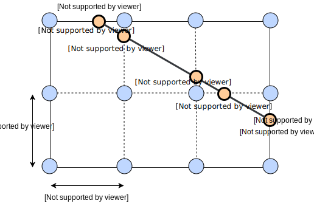
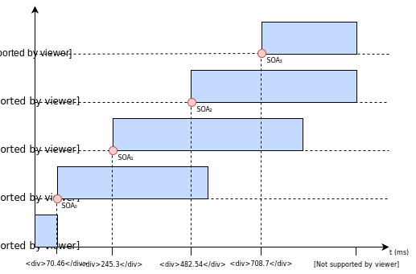
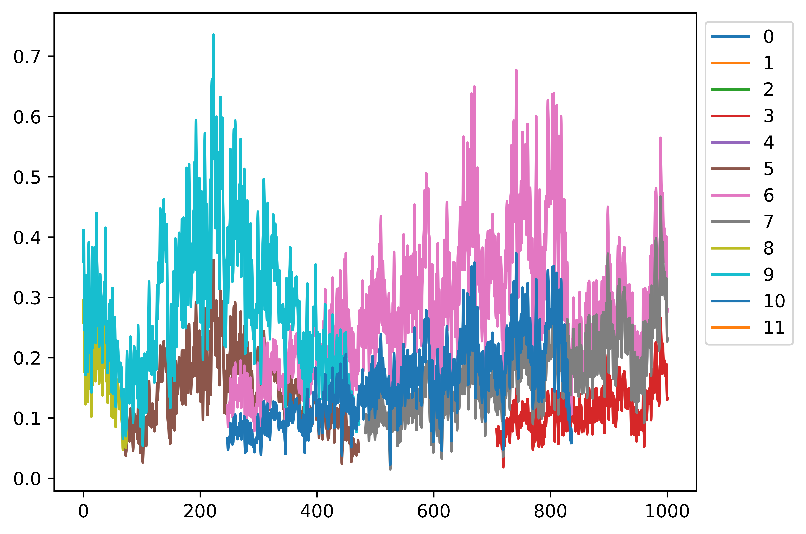
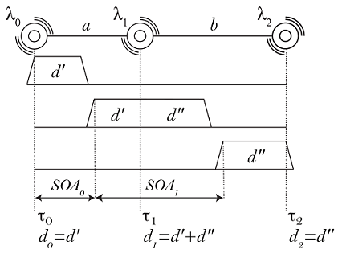

# TactileBrush

<!-- TOC depthFrom:2 depthTo:6 withLinks:1 updateOnSave:1 orderedList:0 -->

- [Introduction](#introduction)
- [When should I use TactileBrush ?](#when-should-i-use-tactilebrush-)
- [Compilation and installation](#compilation-and-installation)
- [Usage](#usage)
	- [Grid](#grid)
	- [Stroke](#stroke)
	- [Mixing grid and stroke](#mixing-grid-and-stroke)
- [Algorithm example](#algorithm-example)
- [Equations](#equations)
- [Footnotes](#footnotes)

<!-- /TOC -->

## Introduction

*Disclaimer : as this is a very specific topic, and because I am a beginner in haptics, this may be totally useless for most people and/or partially wrong. Nevertheless, I did my best and contributions/issues are welcomed.*

This repo proposes an implementation of the Tactile Brush algorithm proposed by Ali Israr and Ivan Poupyrev<sup id="a1">[1](#f1)</sup>. Afaik, there is no other free/libre implementation of this algorithm.

This algorithm gives a general method to create haptic illusions of a 2D motion from a 2D grid of *actuators* (which may be ERMs, LRAs, haptic excitors...). It is based on two known haptic illusions :

* Phantom actuator, or funneling illusion : when you feel an actuator at one place while none is there. Instead, two close actuators are triggered at the same time with a variable intensity, and the brain interprets these signals as a single actuator located in between.
* Apparent motion, when the consecutive activation of two actuators feels like a continuous motion. This illusion is subject to the right choice of duration, frequency, and [SOA](https://en.wikipedia.org/wiki/Stimulus_onset_asynchrony).

## When should I use TactileBrush ?

The algorithm has a few constraints :

* Single-point motion only, *e.g.* imitation of a finger.
* Straight-line motion only.
* Beginning and end of the motion must be located on the grid formed by the actuators.

So, if you have :

1. A 2D grid of any type of actuators, **equally spaced**
2. A way to control individual actuator's intensity
3. A low-latency actuators' activation
4. The wish to make the user feel a continuous motion

This algorithm may be useful to you.

Please note that the algorithm works best with a small number of lines. See [Algorithm example](#algorithm-example) for a limitation when there is more than two lines.

## Compilation and installation

The library has no external dependencies. To compile and install it as a shared library, just :

```bash
$ make
$ sudo make install
```

You can then use the library by including it in your program.

```c++
#include <TactileBrush.h>
```

Don't forget to compile your program with `-ltactilebrush` flag.

## Usage

There is two concepts in TactileBrush : **grid** and **stroke**.

### Grid

A grid is unique to a specific system. You will probably create a single grid in your application and use it for all computations. It is bound to a **physical** prototype.
You always start by creating a 2D-grid representing your **physical** actuators, *e.g.* :

```c++
// Creates a 3*4 grid of actuators, spaced vertically and horizontally by 2.5cm.
TactileBrush t(
  3, // Number of lines
  4, // Number of columns
  2.5); // Spacing of the actuators in centimeters
```

One may wonder why spacing is mandatory as all actuators are equally spaced, see [Equations](#equations) section for this ; real distance between actuators is used to compute the time when an actuator must reach its maximum intensity, which is used in SOA computation for example.

### Stroke

A stroke is an abstract movement which has a start point, an end point, a duration and an intensity. A stroke is completely independent of a grid and has no physical meaning.

You can create it like that. Note that `x` and `y` are units, not centimeters.

```c++
Stroke s(
  1, 2, // Start of the stroke (x, y)
  3, 3, // End of the stroke (x, y)
  1000, // Total duration in milliseconds
  1); // Total intensity (between 0 and 1)
```

### Mixing grid and stroke

You cannot compute anything with a stroke alone, because an unique stroke will produce different parameters for two different grids.

So, now you want to know when, for how long and how strong to trigger physical actuators so that the user feels a given motion. To do that, we need to compute activation steps of physical actuators given a stroke. Once the computation is over, you can exploit the results with something like this :

```c++
const auto& motion = t.computeStrokeSteps(s);
for(const auto& [key, val] : motion) {
  // key contains time of activation in milliseconds
  for(const auto& actuator in val) {
    // actuator.line and actuator.column contains the position of the actuator to trigger
    // actuator.intensity defines the actuator intensity between 0 and 1 included
    // actuator.duration tells us the activation duration in milliseconds
    // actuator.maxIntensity is when the actuator needs to be perceived at its max intensity.
    // ^^^^^^ you could use this to modulate amplitude to smoothen transitions!
  }
}

// Just to sum up the activation parameters and check everything is ok
t.prettyPrint();
```

Then you should have all that you need and you are free to use this data as you want in order to trigger your actuators.

## Algorithm example

You can read the paper to get a better idea of how works the algorithm. Here, I just take a simple example showing the main steps of the algorithm. Let's take a 3x4 grid and a (1, 3) → (4.5, 1) motion which needs to last 1000 milliseconds at full intensity (1).

*On the picture I use centimeters to define the end and the start stroke, but in the code you would have used units. Sorry for the confusion.*



In blue you have the physical actuators, and in orange you can see the *virtual* actuators, or control points, which are the intersection of the grid with the stroke.

Then, thanks to the tactile brush algorithm, we compute two things :
* When those virtual actuators need to be triggered (**start**)
* For how long (**duration**)

The results are (with `Stroke::prettyPrint()`) :

```
Virtual actuator at position (1,3) triggered at 0 ms during 72.3918msec
Virtual actuator at position (1.5,2.71429) triggered at 70.4654 ms during 398.527msec
Virtual actuator at position (3,1.85714) triggered at 245.294 ms during 593.592msec
Virtual actuator at position (3.625,1.5) triggered at 482.543 ms during 558.798msec
Virtual actuator at position (4.5,1) triggered at 708.659 ms during 291.341msec
```

After plotting the above, we have the following :



At this point, we act like our virtual actuators are physical, and we have the trigger time and duration. The last step is to map virtual actuators on physical actuators. This is really simple with the formula given in the paper : we just take the two closest physical actuators, we keep the same start and duration, we just balance the intensity with the energy model given by the authors.

The results are (with `TactileBrush::prettyPrint()`) :

```
Time 0ms :
        Physical actuator at column 0 and line 2 triggered during 72.3918msec with intensity 0.57735
        Physical actuator at column 1 and line 2 triggered during 72.3918msec with intensity 0.816497
Time 70.4654ms :
        Physical actuator at column 1 and line 1 triggered during 398.527msec with intensity 0.436436
        Physical actuator at column 1 and line 2 triggered during 398.527msec with intensity 0.899735
Time 245.294ms :
        Physical actuator at column 2 and line 1 triggered during 593.592msec with intensity 0.872872
        Physical actuator at column 2 and line 2 triggered during 593.592msec with intensity 0.48795
Time 482.543ms :
        Physical actuator at column 2 and line 1 triggered during 558.798msec with intensity 0.763763
        Physical actuator at column 3 and line 1 triggered during 558.798msec with intensity 0.645497
Time 708.659ms :
        Physical actuator at column 3 and line 0 triggered during 291.341msec with intensity 0.57735
        Physical actuator at column 3 and line 1 triggered during 291.341msec with intensity 0.816497
```

We see that each virtual actuator maps on two physical actuators (because in this case, no virtual actuator lies on a physical actuator), and that the start and duration time are the same, but the intensities are different.

A possible result can be seen below. This is what we get when we use a pink noise with amplitude modulation to smooth the activation of tactors (not included in TactileBrush algorithm). You will recognize time of activation, duration and intensities.



Note that the above also exhibits one of the limitations of TactileBrush algorithm, as explained in another paper<sup id="a2">[2](#f2)</sup>. For example, the *pink* actuator is used to render **simultaneously** two virtual actuators (λ<sub>4</sub> and λ<sub>5</sub>), so we have a conflict when modulating amplitude. Quoting the paper :

> [...] the phantom tactors PA and PB can be active at the same time while
sharing a common physical tactor P2. The same problem exists for PB and PC. This
contradicts the assumption that the phantom tactors can be independently controlled
and requires additional handling of the intensity of the overlapping physical tactor [...]

## Equations

Just a quick section to acknowledge that I had to generalize the equations used to compute durations and SOAs. In the paper, the equation system is given for a limited example, along with :

> This set of equations gives us four linear equations and solution for four unknowns: two durations and two SOAs. It is trivial to extend this solution for a larger number of λi.

As I may have done a mistake doing that, verifications are welcomed.

In the paper, these relations are given :

* 
* 
* 
* 

See below the corresponding symbols :



Please note that `v` is the motion's speed and that `𝜏₁ = a/v`, that is, the time when the actuator must be at its maximum intensity so that we end the motion	within the allotted time. And so on, `𝜏₂ = (a + b)/v`...

In the following equations, instead of using `d'`, `d''` and so on, we use a subscript number to indicate the actuator number and a superscript `-` or `+` to indicate if the duration is before or after `𝜏i`.

We came up with the following relations, `n` being the number of virtual actuators :

* 
* 
* 
* 
* 

Combining this, we have all what we need to compute SOA and duration for every virtual actuator. First, compute SOA, and then use relation 1, 3 and 4 to compute duration. Use relation 2 for first and last actuator.

 

## Footnotes

 <b id="f1">1</b> Israr, Ali & Poupyrev, Ivan. (2011). Tactile Brush: Drawing on skin with a tactile grid display. Conference on Human Factors in Computing Systems - Proceedings. 2019-2028. 10.1145/1978942.1979235. [↩](#a1)


 <b id="f2">2</b> Park, Jaeyoung & Kim, Jaeha & Oh, Yonghwan & Tan, Hong. (2016). Rendering Moving Tactile Stroke on the Palm Using a Sparse 2D Array. 9774. 47-56. 10.1007/978-3-319-42321-0_5. [↩](#a2)
